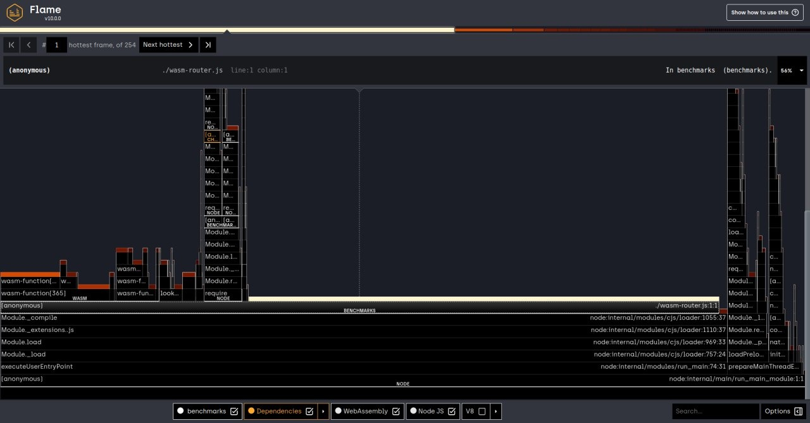

# Wasm Router
This project is an implementation test of an HTTP Router in wasm using [wasm-bindgen](https://github.com/rustwasm/wasm-bindgen) and the fantastic Rust language.

## Inspiration
The code is inspired by [find-my-way](https://github.com/delvedor/find-my-way) trying to implement the same interface.

## Results

For now, the code implements only static route matching, but this is enough to show the limitation of wasm with rust.

```
=======================
 find-my-way benchmark
=======================
short static: 14.287.130 ops/sec
long static: 4.618.477 ops/sec

=======================
 wasm-router benchmark
=======================
short static: 6.500.312 ops/sec
long static: 4.189.161 ops/sec

```



As you can see from flame graph, the time majority was spent running the javascript code, in particular, the time was spent in the passing strings between Rust and Javascript.
The effective execution of Rust code is a little part of the flame graph.

